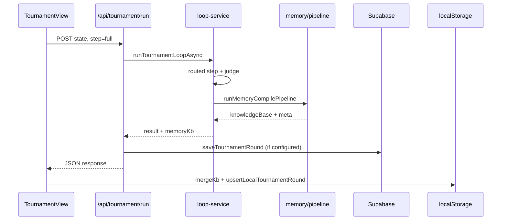

# AI ARENA — Technical Design

**Last updated:** 2026-06-14  
**Stack:** Next.js 16.2.6 (Turbopack), React 19, TypeScript, Tailwind CSS 4, Supabase, provider adapters

---

## System architecture

```
┌─────────────────────────────────────────────────────────────────┐
│                        Next.js App Router                        │
│  app/          pages + API routes                                │
│  components/   UI by domain (tournament, marketplace, memory)  │
│  lib/          domain logic (no React in lib/)                   │
└───────────────┬───────────────────────────────┬─────────────────┘
                │                               │
        ┌───────▼───────┐               ┌───────▼───────┐
        │  Client state │               │  Server/API   │
        │  localStorage │               │  Supabase     │
        │  MemoryStore  │               │  service role │
        │  StackStore   │               │  provider API │
        └───────────────┘               └───────────────┘
```

### Domain modules (`lib/`)

| Module | Path | Responsibility |
|--------|------|----------------|
| Tournament | `lib/tournament/` | Loop, mock data, scoring, persistence |
| Routing | `lib/tournament/router/`, `providers/`, `guard/` | Model router, adapters, rate limits |
| Constitution | `lib/constitution/` | Versions, diff, battle, tournament bridge |
| Marketplace | `lib/marketplace/` | Catalog, stacks, Arena Score, exports |
| Memory | `lib/memory/` | Capture, extract, compile, lint, query |
| Judge | `lib/judge/` | Rubric scoring (arena, battle, tournament) |
| Supabase | `lib/supabase/` | Typed clients, tournament/marketplace saves |
| i18n | `lib/i18n/` | Dictionaries EN/TH |

---

## Frontend architecture

### App Router conventions

- **Pages:** `app/<route>/page.tsx` — thin wrappers importing `components/<domain>/*-view.tsx`
- **API:** `app/api/<domain>/<action>/route.ts` — Zod-validated POST/GET
- **Layouts:** `app/layout.tsx` wraps `Providers` (locale, stack, memory)

### Client providers (`components/providers.tsx`)

```
LocaleProvider → StackProvider → MemoryProvider → children
```

| Provider | Storage key | Purpose |
|----------|-------------|---------|
| `MemoryProvider` | `ai-arena-memory-kb` | Knowledge base merge + lint |
| `StackProvider` | `ai-arena-stack-draft`, `ai-arena-stacks` | Stack Builder drafts |

### UI style system

- Dark theme: `#030303` background, neon cyan/violet accents (`app/globals.css`)
- Cards: `.glass-card` — frosted border, subtle gradient headers
- Typography: Geist Sans + Geist Mono
- Icons: `lucide-react`
- Components: Radix primitives in `components/ui/`

### Key views

| Route | Component |
|-------|-----------|
| `/tournament` | `components/tournament/tournament-view.tsx` |
| `/marketplace` | `components/marketplace/marketplace-list-view.tsx` |
| `/stack-builder` | `components/marketplace/stack-builder-view.tsx` |
| `/memory` | `components/memory/memory-dashboard-view.tsx` |
| `/agents/constitution-builder` | `components/constitution/constitution-builder-view.tsx` |

---

## Backend architecture

### API route pattern

1. Parse JSON with **Zod**
2. Call **lib/** service (never inline business logic in route)
3. Return JSON + HTTP status; errors as `{ error: string }`

### Critical API routes

| Route | Service |
|-------|---------|
| `POST /api/tournament/run` | `runTournamentLoopAsync()` |
| `POST /api/memory/compile` | `runMemoryCompilePipeline()` |
| `POST /api/memory/query` | `queryMemory()` |
| `POST /api/memory/lint` | `lintMemoryKnowledgeBase()` |
| `GET /api/tournament/status` | Engine + Supabase readiness |
| `POST /api/run-agent` | `lib/runner/run-agent.ts` |

### Server-only rules

- `SUPABASE_SERVICE_ROLE_KEY` — admin APIs, account history
- Never import service role into client components
- Env checks via `lib/env.ts` (`hasGroqKey()`, `hasAnthropicKey()`)

---

## Supabase architecture

- **Migrations:** `supabase/migrations/*.sql` — apply with `npm run supabase:push`
- **Client:** `lib/supabase.ts` — anon client for reads/inserts allowed by RLS
- **Server writes:** `lib/supabase/tournaments.ts`, `marketplace.ts`
- **Legacy:** `supabase/schema.sql` reference only — do not edit for new work

### Persistence today vs planned

| Data | MVP storage | Target |
|------|-------------|--------|
| Tournament rounds | Supabase + localStorage | Supabase |
| Marketplace listings | Supabase + mock catalog | Supabase |
| Memory KB | localStorage (`MemoryStore`) | Supabase memory_* tables |
| Constitutions | Mock store + schema ready | Supabase |
| Provider usage | In-memory + schema ready | Supabase logs |

---

## LLM provider architecture

See [09-model-router.md](./09-model-router.md) for detail.

```
TaskType → ModelRouter → ProviderAdapter → generateText()
                ↑
         RateLimitGuard.assess()
```

**Runtime modes** (`TournamentRuntimeMode`):

| Mode | Behavior |
|------|----------|
| `mock` | Heuristic outputs, zero API cost (default) |
| `groq_free` | Groq for challenge + competitor + preliminary judge |
| `hybrid_quality` | Groq loop + premium final judge (when keys present) |

**Task types:** `challenge_generation`, `competitor_run`, `preliminary_judge`, `final_judge`, `benchmark_report`, `marketplace_polish`

---

## Tournament loop architecture

See [06-tournament-engine.md](./06-tournament-engine.md).

```
TournamentView (client)
    │ POST /api/tournament/run { state, step, runtimeMode }
    ▼
runTournamentLoopAsync()
    ├── rateLimitGuard.assess()
    ├── runRoutedTournamentStep()  [or sync runTournamentLoop() fallback]
    ├── finalizeConstitutionMetaFromEvaluations()
    ├── runMemoryCompilePipeline()  [on evaluate/full]
    └── return { ...state, memoryKb }
    │
    ▼
Client: mergeKb(memoryKb) + MemoryTournamentPanel
```

**Loop interval:** `TOURNAMENT_LOOP_MS = 5 * 60 * 1000` (`lib/tournament/constants.ts`)

**Steps:** `full` | `generate` | `run` | `evaluate`

---

## Data flow

### Round complete flow



### Marketplace candidate flow

1. Evaluations ranked by `computeTotalScore()`
2. `detectMarketplaceCandidates()` builds candidates with proof
3. Top 5 upserted to Supabase on auto-save
4. Memory pipeline adds `marketplace_evidence_notes`

---

## Error handling

| Layer | Strategy |
|-------|----------|
| API routes | try/catch → 500 + message; Zod → 400 |
| Groq / live calls | Catch in loop-service → fallback to `mock` + history event |
| Supabase save | Non-blocking; `persistError` in response; local save always |
| Client offline | `runTournamentLoop()` local fallback + mergeKb |
| Provider unavailable | `ProviderAdapter.getProviderStatus().available === false` → mock |

### User-visible signals

- Tournament: `persistMessage` banner (saved locally / Supabase error)
- Routing: guard message in `RoutingDashboard`
- Memory compile: panel hidden until `memory.compiled_at` set

---

## Rate limit handling

**Component:** `lib/tournament/guard/rate-limit-guard.ts`

**Inputs:** runtime mode, competitor count, includeFinalJudge flag

**Outputs:** `GuardAssessment`

| Field | Use |
|-------|-----|
| `canRun` | Block live mode if over limits |
| `recommendedAction` | `proceed`, `reduce_competitors`, `skip_final_judge`, `delay_loop`, `switch_to_mock` |
| `riskLevel` | `low` / `medium` / `high` |

**Actions taken:**

1. Pre-flight estimate of API calls + tokens
2. Compare against Groq free-tier heuristics (RPM/RPD/TPD)
3. Reduce competitors to 3 if `reduce_competitors`
4. Fall back to mock with history event if blocked

**DB logging (planned):** `rate_limit_events`, `provider_usage_logs` tables in migration `20250201000000`

---

## Security summary

- Admin: HTTP Basic Auth (`ADMIN_USERNAME` / `ADMIN_PASSWORD`)
- RLS v2: no public UPDATE on submissions
- Service role: server-only
- No secrets in client bundles (`NEXT_PUBLIC_*` only for Supabase anon)

---

## Next.js version note

This project uses **Next.js 16** with breaking changes vs training data. Before modifying routing, middleware, or data fetching, read:

`node_modules/next/dist/docs/`

---

## Related docs

- [Supabase schema](./04-supabase-schema.md)
- [Tournament engine](./06-tournament-engine.md)
- [Model router](./09-model-router.md)
- [Memory compiler](./08-memory-compiler.md)
