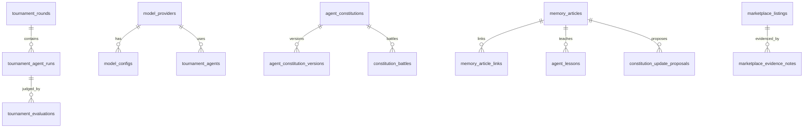

# AI ARENA — Supabase Schema

**Last updated:** 2026-06-14  
**Apply:** `npm run supabase:push`  
**New migrations:** `npm run supabase:new -- description`

---

## Overview

AI ARENA uses Supabase Postgres with RLS. Schema is split into **7 ordered migrations**. Application layer is **mock-first** for memory and constitution; tournament rounds and marketplace listings are actively persisted when env is configured.

---

## Migration order

| # | File | Domain |
|---|------|--------|
| 1 | `20250101000000_submissions_and_battles.sql` | Human submissions, battles |
| 2 | `20250102000000_tournament_rounds.sql` | Tournament snapshots |
| 3 | `20250103000000_marketplace_listings.sql` | Marketplace v1 listings |
| 4 | `20250104000000_rls_v2_submissions.sql` | Tighter submission RLS |
| 5 | `20250201000000_model_provider_routing.sql` | Providers, agents, usage logs |
| 6 | `20250202000000_agent_constitutions.sql` | Constitution system |
| 7 | `20250203000000_tournament_memory_compiler.sql` | Memory compiler tables |

**Rule:** Never edit applied migrations — add new files only (see `.cursor/rules/supabase-migrations.mdc`).

---

## Entity relationship (high level)



---

## Core tables (MVP active)

### `submissions`

Human workflow submissions for challenges.

| Column | Notes |
|--------|-------|
| `challenge_id` | Default `executive-summary-battle` |
| `quality_score`, `cost_score`, `final_score` | Admin judge fills |
| `status` | `pending` \| `approved` \| `rejected` |

**Indexes:** `(challenge_id, status)`, leaderboard composite

### `battles`

5-agent token battle records (MVP9).

### `tournament_rounds`

Full tournament state snapshot per round.

| Column | Notes |
|--------|-------|
| `tournament_id`, `round` | Logical tournament key |
| `mode` | `mock` \| `live` |
| `payload` | JSONB full `TournamentState` |
| `runtime_mode`, `routing_timeline`, `guard_snapshot` | Added in T-V2 migration |

**Indexes:** `(tournament_id, round desc)`, `created_at desc`

### `marketplace_listings`

Tournament-derived workflow listings.

| Column | Notes |
|--------|-------|
| `slug` | Unique URL key |
| `marketplace_score` | Weighted reusability score |
| `status` | `seed` \| `review` \| `listed` |
| `workflow_steps`, `prompt_template` | Export payload |

---

## Model routing tables (T-V2)

### `model_providers`

Seed: `mock`, `groq`, `anthropic`, `openai`

### `model_configs`

Per-model RPM/RPD/TPD limits and pricing.

### `runtime_modes`

Seed: `free`, `cheap`, `quality`, `enterprise` — policy JSONB

**Note:** App UI uses `mock` / `groq_free` / `hybrid_quality`; DB runtime_modes are forward-compatible policy store.

### `tournament_agents`

Agent → primary_provider + primary_model + fallback + policies

Seed includes: `lean`, `fast`, `rag`, `multi-agent`, `premium`, creators

### `tournament_agent_runs`

Per-agent execution log with tokens, cost, latency

### `tournament_evaluations`

Judge stage (`preliminary` \| `final`), scores JSONB

### `provider_usage_logs` / `rate_limit_events`

Audit and guard telemetry

---

## Constitution tables

### `agent_constitutions`

Parent record per agent (`agent_id`, `current_version`)

### `agent_constitution_versions`

Full field set matching `AgentConstitution` type:

- `role_definition`, `behavior_rules`, `cost_policy`, `self_review_protocol`, etc.
- `constitution_score`

### `prompt_diffs`

Version diff snapshots (`changes` JSONB)

### `constitution_battles` / `constitution_battle_results`

System Prompt Battle outcomes

### `constitution_marketplace_candidates`

Constitution-derived marketplace seeds

---

## Memory compiler tables

### `tournament_events`

Captured lifecycle events (phase, agent_id, payload)

### `memory_logs`

Daily / per-round digest

### `memory_articles`

Knowledge articles — `article_type` enum (10 types)

### `memory_article_links`

Graph edges: `supports`, `contradicts`, `extends`, `evidence_for`

### `agent_lessons`

Per-agent lesson store — `lesson_type` enum (8 types)

### `strategy_recommendations`

Actionable strategy advice

### `constitution_update_proposals`

Field-level change proposals with status workflow

### `knowledge_compile_runs`

Compile audit trail

### `memory_lint_reports`

Health score + issues JSONB

### `marketplace_evidence_notes`

Links marketplace candidates to evidence articles

---

## Indexes strategy

| Pattern | Example |
|---------|---------|
| Tournament lookup | `(tournament_id, round desc)` |
| Time series | `created_at desc` |
| Status filters | `(status, score desc)` |
| Agent lessons | `(agent_id, lesson_type)` |
| Article browse | `(article_type, created_at desc)` |

---

## RLS placeholder strategy

### Current (MVP)

| Table group | anon/authenticated | Notes |
|-------------|-------------------|-------|
| submissions | SELECT + INSERT; UPDATE removed in RLS v2 | Admin uses service role |
| tournament_rounds | SELECT + INSERT | Public read/write for demo |
| marketplace_listings | SELECT (seed/review/listed) + INSERT | |
| memory_articles, agent_lessons | SELECT only | Writes via service role (future) |
| model_providers, configs | SELECT | Config reference data |
| provider_usage_logs | SELECT + INSERT | Tournament API logging |

### Planned tightening

1. **Writes** on tournament/memory → service role or authenticated admin role only
2. **Public read** on published marketplace + memory articles with `confidence >= threshold`
3. **Enterprise** tables with org_id + membership policies (future)
4. **PII** on submissions — email visible only to owner + admin

### Policy naming convention

```
{table}_{audience}_{operation}
e.g. memory_articles_public_select
```

---

## Seed data plan

| Source | Method | Contents |
|--------|--------|----------|
| SQL migrations | `INSERT ... ON CONFLICT DO NOTHING` | Providers, models, runtime_modes, tournament_agents |
| App mock catalog | `lib/marketplace/mock-catalog.ts` | 20+ components (not in DB yet) |
| Memory seed | `lib/memory/mock-data.ts` → `MemoryStore` | Demo articles, lessons, proposals |
| Constitution mock | `lib/constitution/mock-data.ts` | Lean v1.0–v1.2 |
| Drizzle seed (legacy) | `db/seed.ts` | Optional; prefer Supabase migrations |

### Future Supabase seed script

```
scripts/seed-memory-demo.ts   → insert seed articles if empty
scripts/seed-components.ts    → sync mock-catalog to components table (TBD)
```

---

## TypeScript alignment

Generate or maintain row types in `lib/supabase/types.ts` when wiring persistence. Domain types live in:

- `lib/tournament/types.ts`
- `lib/memory/types.ts`
- `lib/constitution/types.ts`
- `lib/marketplace/types.ts`

**Rule:** DB column names = snake_case; TS domain = camelCase at API boundary.

---

## Environment variables

| Variable | Required for |
|----------|--------------|
| `NEXT_PUBLIC_SUPABASE_URL` | All Supabase |
| `NEXT_PUBLIC_SUPABASE_ANON_KEY` | Client reads |
| `SUPABASE_SERVICE_ROLE_KEY` | Admin + bypass RLS |
| `SUPABASE_DB_PASSWORD` | CLI push |

---

## Related docs

- [Tech design](./03-tech-design.md)
- [Memory compiler](./08-memory-compiler.md)
- [supabase/README.md](../supabase/README.md)
