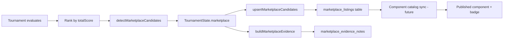

# AI ARENA — Marketplace & Stack Builder

**Last updated:** 2026-06-14  
**Code:** `lib/marketplace/` · **UI:** `/marketplace`, `/components`, `/stack-builder`, `/stacks/[id]`

Inspired by tournament-tested component marketplaces (e.g. [aitmpl.com](https://aitmpl.com/)) — adapted for AI ARENA's autonomous proof engine.

---

## Marketplace component taxonomy

### `ComponentType` (13 types)

| Type | Description | Example |
|------|-------------|---------|
| `agent_constitution` | Full agent operating spec | Lean Operator v1.2 |
| `workflow_template` | Multi-step workflow | Executive summary pipeline |
| `judge_rubric` | Scoring dimensions + weights | Quality + efficiency rubric |
| `challenge_template` | Reusable challenge brief | Board memo under $0.01 |
| `model_router` | Provider routing policy | Groq-first hybrid |
| `cost_policy` | Token/cost caps | Minimize under 900 tokens |
| `evaluation_hook` | Post-run evaluation script | Cost limit penalty hook |
| `mcp_integration` | MCP server config | Supabase MCP hook |
| `benchmark_report` | Round summary report | Round 12 benchmark PDF |
| `tournament_pack` | Bundle of arena artifacts | Full arena starter pack |
| `prompt_template` | Single-shot prompt | C-suite summary prompt |
| `storage_hook` | Persistence pattern | Tournament round saver |
| `setup_pack` | IDE bootstrap | Cursor rules + env template |

**Labels & colors:** `COMPONENT_TYPE_LABELS`, `COMPONENT_TYPE_COLORS` in `lib/marketplace/types.ts`

---

## Component detail structure

### `MarketplaceComponent`

| Section | Fields |
|---------|--------|
| Identity | `id`, `slug`, `type`, `title`, `description`, `version` |
| Authorship | `author`: tournament \| admin \| community |
| Tags | `tags[]`, `categories[]` |
| Compatibility | `compatible_providers[]`, `compatible_ides[]` |
| Proof | `proof: ComponentPerformanceProof` |
| Score | `arena_score: ArenaScoreBreakdown` |
| Status | `draft` → `candidate` → `review` → `published` → `deprecated` |
| Commerce | `suggested_price_usd` |
| Install | `payload_preview`, `install_notes`, `usage_examples[]` |
| Lineage | `source_tournament_id`, `source_round` |

### Performance proof

```typescript
ComponentPerformanceProof {
  win_rate, avg_score, avg_cost_usd, avg_tokens,
  best_category, worst_category, tournament_runs,
  benchmark_history: { round, score, cost }[],
  recommended_use_cases[], last_tournament_at
}
```

### Arena Score breakdown (0–100 total)

| Dimension | Weight concept |
|-----------|----------------|
| `battle` | Head-to-head win rate |
| `cost_efficiency` | $/quality point |
| `reliability` | Completion rate |
| `reusability` | Cross-challenge performance |
| `enterprise_readiness` | Audit + format compliance |
| `popularity` | Views/installs (future) |
| `freshness` | Decay since last tournament |
| `compatibility` | Provider/IDE coverage |

**Calculator:** `lib/marketplace/arena-score.ts`

---

## Tournament-tested badges

**Flag:** `tournament_tested: boolean`

**True when:**

- `source_tournament_id` and `source_round` present
- `proof.tournament_runs >= 1`
- Component originated from `detectMarketplaceCandidates()` or constitution battle winner

**UI:** `ComponentTypeBadge`, tournament-tested pill on `ComponentCard`

**Candidate pipeline status:**

| Status | Meaning |
|--------|---------|
| `seed` | Auto-generated from round |
| `review` | Admin/curator review |
| `listed` | Public marketplace |

---

## Stack Builder workflow

**Route:** `/stack-builder`  
**Provider:** `StackProvider` (`components/marketplace/stack-provider.tsx`)

### Steps

1. **Browse catalog** — filter by type, provider, min Arena Score, tournament-tested only
2. **Add to stack** — assign `StackComponentRole`:
   - `agent`, `judge`, `challenge`, `router`, `hook`, `setup`, `policy`, `report`
3. **Order components** — `order` field for execution sequence
4. **Validate** — `stack-validator.ts` emits `CompatibilityWarning[]`
5. **Estimate** — `stack-estimator.ts` → `estimated_cost_usd`, `estimated_quality_score`
6. **Save** — localStorage stacks collection
7. **Export** — see formats below
8. **Share** — `/stacks/[id]` detail page

### Compatibility warnings

| Severity | Example |
|----------|---------|
| `error` | Two conflicting model routers |
| `warning` | Premium constitution + minimize cost policy |
| `info` | Missing judge component |

---

## Export formats

**Module:** `lib/marketplace/stack-export.ts`

| Format | `StackExportFormat` | Output |
|--------|---------------------|--------|
| JSON | `json` | Structured stack manifest + proof |
| Markdown | `markdown` | Human-readable install doc |
| Cursor | `cursor` | `.cursor/rules` style pack |
| Claude Code | `claude-code` | CLAUDE.md snippets + hooks plan |
| Supabase | `supabase-snippet` | SQL/migration hints |
| API plan | `api-plan` | Endpoint sketch for automation |

**UI:** Export dropdown in `stack-builder-view.tsx`

---

## Marketplace candidate pipeline



### `MarketplaceCandidateV2`

Links tournament proof to component catalog entry:

- `component_id`, `slug`, `type`
- `agent_id`, `challenge_title`
- `total_score`, `marketplace_score`
- Full `proof` + `arena_score`

### Dual marketplace surfaces

| Surface | Route | Content |
|---------|-------|---------|
| Listings v1 | `/marketplace`, `/marketplace/[slug]` | Supabase-backed tournament winners |
| Component catalog v2 | `/components`, `/components/[id]` | Full taxonomy + Arena Score |

---

## Storage keys

| Key | Content |
|-----|---------|
| `ai-arena-stack-draft` | In-progress builder state |
| `ai-arena-stacks` | Saved `WorkflowStack[]` |

---

## API routes

| Route | Purpose |
|-------|---------|
| `GET /api/marketplace` | List listings |
| `GET /api/marketplace/[slug]` | Detail |
| `GET /api/components` | Catalog filter (mock) |

---

## Related docs

- [Tournament engine](./06-tournament-engine.md)
- [Memory compiler](./08-memory-compiler.md)
- [Product vision](./01-product-vision.md)
