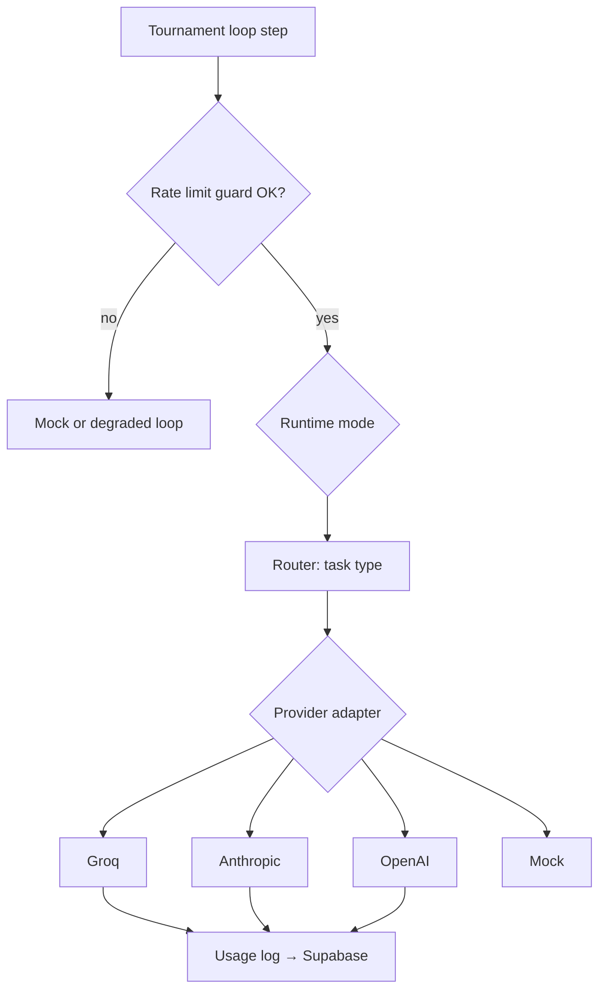

# AI ARENA — Tournament Engine V2 Architecture

**Multi-provider AI routing · Groq-first · Claude/GPT for high-value tasks**

Date: 2026-06-14 · Status: **Design approved for implementation** · Builds on existing tournament loop (mock + Anthropic-only live path)

---

## Executive summary

The current Tournament Engine (`lib/tournament/engine.ts`) runs either **mock** (no API key) or **live Anthropic-only** (`lib/tournament/llm.ts`). V2 adds a **Model Provider Router** so high-frequency loop steps use **Groq** (fast, free-tier friendly, OpenAI-compatible) while **Claude/GPT** handle final judging, benchmark reports, marketplace polish, and enterprise review.

**Principles:**

- Keep existing tournament concepts: creators → challenge → competitors → judges → leaderboard → marketplace seeds
- Keep **mock mode** as zero-cost fallback
- All real API calls go through **provider adapters** — never call Groq/Anthropic/OpenAI directly from UI
- Router chooses provider by **task type** + **runtime mode** + **rate-limit guard**

---

## 1. Model Provider Router

### Task types

| Task | Default provider | Model tier | Notes |
|------|------------------|------------|-------|
| `challenge_generation` | Groq | fast open model | 3 creator agents × 1 call |
| `competitor_execution` | Groq | per-agent profile | 5 parallel runs typical |
| `preliminary_judging` | Groq | fast judge model | Quality + efficiency heuristics via LLM |
| `final_judging` | Claude or GPT | sonnet/gpt-4o | Optional; skipped in Free/Cheap if over budget |
| `benchmark_report` | Claude or GPT | opus/gpt-4o | Public benchmark narrative |
| `marketplace_polish` | Claude or GPT | sonnet | Prompt template + listing copy |
| `enterprise_review` | Claude or GPT + human | premium | Audit log + admin gate |

### Router function (conceptual)

```typescript
type TaskType =
  | "challenge_generation"
  | "competitor_execution"
  | "preliminary_judging"
  | "final_judging"
  | "benchmark_report"
  | "marketplace_polish"
  | "enterprise_review";

type RouteDecision = {
  provider: "mock" | "groq" | "anthropic" | "openai";
  model: string;
  maxTokens: number;
  temperature: number;
  fallback?: RouteDecision;
  skipped?: boolean;
  skipReason?: string;
};

function routeTask(
  task: TaskType,
  runtimeMode: RuntimeMode,
  agentProfile?: AgentModelProfile,
  guard?: RateLimitEstimate,
): RouteDecision;
```

### Routing rules (priority order)

1. **No API keys / guard says mock** → `mock` adapter
2. **Runtime mode** constrains allowed providers (see §2)
3. **Task type** picks primary provider per table above
4. **Agent profile** overrides model/tokens/temperature for `competitor_execution`
5. **Rate limit guard** may downgrade: skip final judge, reduce competitors, delay loop



### File layout (target)

```
lib/tournament/
  engine.ts              # orchestrator (unchanged entry, calls loop service)
  engine-mock.ts         # unchanged mock implementations
  loop-service.ts        # NEW: async loop with router + guard
  router/
    index.ts             # routeTask()
    task-routes.ts       # task → provider defaults
    runtime-modes.ts     # mode constraints
  providers/
    types.ts             # ProviderAdapter interface
    mock.ts
    groq.ts              # OpenAI-compatible client → api.groq.com
    anthropic.ts         # wraps existing llm.ts patterns
    openai.ts            # optional GPT path
  guard/
    rate-limit-guard.ts  # pre-loop estimate + degrade
    estimates.ts         # token/call math
  usage/
    usage-logger.ts      # persist provider_usage_logs
  profiles/
    agent-profiles.ts    # Lean / Premium / Fast defaults
  llm.ts                 # DEPRECATE gradually → anthropic adapter
```

---

## 2. Runtime modes

| Mode | ID | Groq | Claude/GPT | Final judge | Human review | Use case |
|------|-----|------|------------|-------------|--------------|----------|
| **Free** | `free` | ✅ primary | ❌ | ❌ (Groq prelim only) | ❌ | Demo, free tier |
| **Cheap** | `cheap` | ✅ primary | ⚠️ limited fallback | Optional if budget | ❌ | Dev/staging |
| **Quality** | `quality` | ✅ agent runs | ✅ final judge | ✅ | ❌ | Public tournaments |
| **Enterprise** | `enterprise` | ✅ bulk runs | ✅ all premium tasks | ✅ | ✅ | Private org benchmarks |

Stored in Supabase `runtime_modes` (seed rows) + tournament state / session.

**Mode behavior:**

```typescript
type RuntimeMode = "free" | "cheap" | "quality" | "enterprise";

const MODE_POLICY: Record<RuntimeMode, {
  allowFinalJudge: boolean;
  allowPremiumProviders: boolean;
  maxCompetitors: number;
  auditLog: boolean;
}> = {
  free:       { allowFinalJudge: false, allowPremiumProviders: false, maxCompetitors: 3, auditLog: false },
  cheap:      { allowFinalJudge: true,  allowPremiumProviders: "limited", maxCompetitors: 5, auditLog: false },
  quality:    { allowFinalJudge: true,  allowPremiumProviders: true, maxCompetitors: 5, auditLog: false },
  enterprise: { allowFinalJudge: true,  allowPremiumProviders: true, maxCompetitors: 5, auditLog: true },
};
```

Tournament page: **Runtime Mode selector** persists to `tournament.runtimeMode` in state + optional Supabase column on `tournament_rounds`.

---

## 3. Agent model profiles

Each competitor agent gets a profile (DB + TypeScript defaults).

### Profile schema

```typescript
type CostPolicy = "minimize" | "balanced" | "quality_first";
type LatencyPolicy = "minimize" | "balanced";
type QualityPolicy = "minimize" | "balanced" | "maximize";

type AgentModelProfile = {
  agentId: CompetitorAgentId;
  primaryProvider: "groq" | "anthropic" | "openai";
  primaryModel: string;
  fallbackProvider: "groq" | "anthropic" | "openai" | "mock";
  fallbackModel: string;
  maxTokens: number;
  temperature: number;
  costPolicy: CostPolicy;
  latencyPolicy: LatencyPolicy;
  qualityPolicy: QualityPolicy;
};
```

### Default profiles (V2 seed)

| Agent | Primary | Model (Groq) | Fallback | max_tokens | temp | Goal |
|-------|---------|--------------|----------|------------|------|------|
| **lean** | Groq | `llama-3.1-8b-instant` | Groq `gemma2-9b-it` | 900 | 0.2 | Lowest cost |
| **fast** | Groq | `llama-3.1-8b-instant` | Groq | 800 | 0.3 | Lowest latency |
| **rag** | Groq | `llama-3.3-70b-versatile` | Anthropic haiku | 1500 | 0.4 | Grounded quality |
| **multi-agent** | Groq | `llama-3.3-70b-versatile` | Anthropic sonnet | 2200 | 0.5 | Multi-step |
| **premium** | Anthropic | `claude-sonnet-4-6` | Groq `llama-3.3-70b` | 2500 | 0.6 | Highest quality |

Creator agents (challenge generation): Groq `llama-3.3-70b-versatile`, temp 0.7.

Preliminary judges: Groq `llama-3.1-8b-instant`.

Final judge (Quality mode+): Anthropic `claude-sonnet-4-6` or OpenAI `gpt-4o`.

---

## 4. Rate limit guard

Runs **before every loop** (and optionally before each batch).

### Estimates per full round

| Step | Calls | Est. in tokens | Est. out tokens |
|------|-------|----------------|-----------------|
| Challenge gen | 3 | 3 × 800 | 3 × 600 |
| Competitor runs | N (3–5) | N × 2000 | N × 1200 |
| Prelim judge | N | N × 1500 | N × 400 |
| Final judge | 0–N | N × 2000 | N × 800 |

### Guard output

```typescript
type RateLimitEstimate = {
  apiCalls: number;
  inputTokens: number;
  outputTokens: number;
  requestsPerMinute: number;
  requestsPerDay: number;
  tokensPerDay: number;
  riskLevel: "low" | "medium" | "high" | "blocked";
  actions: GuardAction[];
};

type GuardAction =
  | { type: "reduce_competitors"; to: number }
  | { type: "skip_final_judge" }
  | { type: "switch_mock" }
  | { type: "delay_next_run"; ms: number }
  | { type: "batch_defer"; task: TaskType };
```

### Degrade ladder (when risk ≥ medium)

1. Skip optional final judge
2. Reduce competitors 5 → 3
3. Delay next run (+5 min)
4. Switch to mock for remainder of session
5. Log `rate_limit_events` row

Groq free-tier reference limits (configure in `model_configs`): RPM ~30, RPD ~14k requests (verify against current Groq docs at deploy time).

---

## 5. Provider usage tracking

Every adapter call emits:

```typescript
type UsageRecord = {
  provider: string;
  model: string;
  taskType: TaskType;
  tournamentId?: string;
  round?: number;
  agentId?: string;
  requests: number;
  inputTokens: number;
  outputTokens: number;
  totalTokens: number;
  estimatedCostUsd: number;
  latencyMs: number;
  errorRate: number;      // rolling window
  rateLimitHit: boolean;
};
```

Persisted to `provider_usage_logs`. Aggregates power Tournament UI cards and admin analytics.

---

## 6. Supabase schema

Migration: `supabase/migrations/20250201000000_model_provider_routing.sql`

### New tables

| Table | Purpose |
|-------|---------|
| `model_providers` | groq, anthropic, openai, mock — enabled, base URL, priority |
| `model_configs` | model id, provider, RPM/RPD limits, pricing per 1M tokens |
| `runtime_modes` | free/cheap/quality/enterprise policies (JSON) |
| `provider_usage_logs` | per-call usage rows |
| `rate_limit_events` | guard decisions + actions taken |

### Extended tables

| Table | New columns |
|-------|-------------|
| `tournament_agents` (new) | agent profiles: provider, models, policies |
| `tournament_agent_runs` (new) | provider, model, tokens, cost, latency, task_type |
| `tournament_evaluations` (new) | judge_provider, judge_model, preliminary vs final |
| `tournament_rounds` | `runtime_mode`, `routing_timeline` jsonb, `guard_snapshot` jsonb |

See migration file for full DDL.

---

## 7. Tournament page UI (V2)

Add to `components/tournament/tournament-view.tsx` and new subcomponents:

| Component | Purpose |
|-----------|---------|
| `RuntimeModeSelector` | free / cheap / quality / enterprise |
| `ProviderStatusCards` | Groq / Anthropic / OpenAI connectivity |
| `GroqUsageCard` | today's RPM, tokens, free-tier % used |
| `RateLimitRiskBadge` | low / medium / high + suggested actions |
| `CostSavedEstimate` | Groq vs all-Claude counterfactual |
| `ModelRoutingTimeline` | per-step provider chosen this round |
| `AgentModelBadge` | on each competitor row |
| `ProviderComparisonAnalytics` | latency/cost/quality by provider |

Data from `GET /api/tournament/status` (extended) + `GET /api/tournament/usage`.

---

## 8. Revised MVP plan (Tournament V2)

| MVP | Scope | Status |
|-----|-------|--------|
| **T-MVP1** | Mock tournament loop only | ✅ **Done** (current `engine-mock.ts`) |
| **T-MVP2** | Groq-powered real agent loop (challenge + competitors + prelim judge) | ⏳ Next |
| **T-MVP3** | Hybrid judge — Groq prelim + Claude/GPT final evaluation | ⏳ |
| **T-MVP4** | Public benchmark + marketplace candidate generation (premium polish) | ⏳ Partial (marketplace UI exists) |
| **T-MVP5** | Enterprise/private tournaments + audit + human review | ⏳ Partial (enterprise page exists) |

This **replaces** generic Phase E (MVP22–24) for tournament-specific work; align HANDOFF Phase E with T-MVP2–5.

---

## 9. Implementation plan (Next.js + Supabase)

### Phase A — Foundation (1–2 days)

1. Add env vars to `lib/env.ts` + `env.import.example`
2. Create `lib/tournament/providers/types.ts` — `ProviderAdapter` interface
3. Implement `mock.ts` adapter (wrap existing mock)
4. Implement `groq.ts` — OpenAI SDK with `baseURL: https://api.groq.com/openai/v1`
5. Unit-test adapter with single completion call

### Phase B — Router + profiles (2–3 days)

6. `router/index.ts` + `runtime-modes.ts` + `agent-profiles.ts`
7. Refactor `llm.ts` → `providers/anthropic.ts` (keep exports stable)
8. `loop-service.ts` — replace direct `hasAnthropicKey()` branch in `engine.ts`
9. Extend `TournamentState` with `runtimeMode`, `routingTimeline`, `guardSnapshot`

### Phase C — Guard + usage (2 days)

10. `guard/rate-limit-guard.ts` + pre-loop hook in `/api/tournament/run`
11. `usage/usage-logger.ts` + Supabase insert
12. Run migration `20250201000000_model_provider_routing.sql`
13. Extend `/api/tournament/status` with provider health

### Phase D — UI (2–3 days)

14. New tournament UI components (§7)
15. Wire Runtime Mode selector → API body `{ state, step, runtimeMode }`
16. i18n keys for new labels

### Phase E — Premium path (3–5 days)

17. Final judge via Anthropic/OpenAI in Quality+ modes
18. Marketplace polish task after `createMarketplaceCandidates`
19. Enterprise mode audit log table + admin export

### Environment variables

```env
# Groq (T-MVP2+ primary)
GROQ_API_KEY=gsk_...

# Existing
ANTHROPIC_API_KEY=sk-ant-...
OPENAI_API_KEY=sk-...

# Router defaults
TOURNAMENT_DEFAULT_RUNTIME_MODE=free
TOURNAMENT_GROQ_MODEL_FAST=llama-3.1-8b-instant
TOURNAMENT_GROQ_MODEL_QUALITY=llama-3.3-70b-versatile
TOURNAMENT_ENABLE_FINAL_JUDGE=true
TOURNAMENT_MOCK_ON_RATE_LIMIT=true
```

### Provider adapter interface

```typescript
export interface ProviderAdapter {
  readonly id: "mock" | "groq" | "anthropic" | "openai";
  isAvailable(): boolean;
  complete(req: CompletionRequest): Promise<CompletionResponse>;
}

export type CompletionRequest = {
  taskType: TaskType;
  system: string;
  messages: { role: "user" | "assistant"; content: string }[];
  model: string;
  maxTokens: number;
  temperature: number;
  jsonMode?: boolean;
};

export type CompletionResponse = {
  text: string;
  inputTokens: number;
  outputTokens: number;
  latencyMs: number;
  model: string;
  provider: string;
};
```

### API changes

| Endpoint | Change |
|----------|--------|
| `POST /api/tournament/run` | Accept `runtimeMode`; run guard first; return `routingTimeline`, `guardSnapshot`, `usageSummary` |
| `GET /api/tournament/status` | Add `groqAvailable`, `providers`, `usageToday`, `rateLimitRisk` |
| `GET /api/tournament/usage` | **NEW** — aggregated provider stats |

---

## 10. Cursor-ready implementation prompt

Copy everything below into a new Cursor chat to implement T-MVP2:

---

```
Implement AI ARENA Tournament Engine V2 — multi-provider routing (Groq-first).

Read first:
- docs/TOURNAMENT-ENGINE-V2.md (full architecture)
- lib/tournament/engine.ts, engine-mock.ts, llm.ts, types.ts
- components/tournament/tournament-view.tsx
- supabase/migrations/20250201000000_model_provider_routing.sql

Constraints:
- Do NOT remove existing tournament concepts or mock mode
- All real API calls via ProviderAdapter only
- Groq uses OpenAI-compatible API (baseURL https://api.groq.com/openai/v1)
- Claude/GPT only for final_judging, benchmark_report, marketplace_polish, enterprise_review
- Keep backward compatibility: no GROQ_API_KEY → mock (same as today without ANTHROPIC_API_KEY)

Implement in order:

1. lib/tournament/providers/types.ts — ProviderAdapter + CompletionRequest/Response
2. lib/tournament/providers/mock.ts — delegate to engine-mock helpers
3. lib/tournament/providers/groq.ts — OpenAI client + GROQ_API_KEY from lib/env.ts (add hasGroqKey())
4. lib/tournament/providers/anthropic.ts — extract from lib/tournament/llm.ts
5. lib/tournament/router/index.ts — routeTask(task, runtimeMode, profile, guard)
6. lib/tournament/router/runtime-modes.ts — free/cheap/quality/enterprise policies
7. lib/tournament/profiles/agent-profiles.ts — default profiles per competitor
8. lib/tournament/guard/rate-limit-guard.ts — estimate + degrade actions
9. lib/tournament/usage/usage-logger.ts — insert provider_usage_logs (graceful if table missing)
10. lib/tournament/loop-service.ts — runTournamentLoopRouted(state, step, runtimeMode)
11. Update lib/tournament/engine.ts — runTournamentLoopAsync calls loop-service; preserve mock fallback
12. Update app/api/tournament/run/route.ts — accept runtimeMode, return routingTimeline
13. Update app/api/tournament/status/route.ts — groqAvailable, provider cards data
14. Add app/api/tournament/usage/route.ts
15. Run supabase migration 20250201000000_model_provider_routing.sql (npm run supabase:push)
16. Tournament UI: RuntimeModeSelector, ProviderStatusCards, GroqUsageCard, RateLimitRiskBadge,
    ModelRoutingTimeline, AgentModelBadge on tournament-view.tsx
17. Update env.import.example, HANDOFF.md, npm run build, npm run e2e

Tests:
- Mock mode unchanged when no keys
- With GROQ_API_KEY only: full loop uses Groq for challenge + competitors + prelim judge
- With GROQ + ANTHROPIC in quality mode: final judge uses Anthropic
- Rate limit guard reduces competitors when estimates exceed thresholds

Do not commit secrets. Match existing code style and Next.js 16 patterns (await params).
```

---

## Migration from current code

| Current | V2 |
|---------|-----|
| `hasAnthropicKey()` → live | `hasGroqKey()` \|\| `hasAnthropicKey()` → live; router picks per task |
| `lib/tournament/llm.ts` monolith | Split into providers + loop-service |
| `TournamentMode = live \| mock` | Extend: `liveGroq`, `liveHybrid`, `mock`; or keep `live` + `runtimeMode` |
| Single `ANTHROPIC_API_KEY` env | + `GROQ_API_KEY`, optional `OPENAI_API_KEY` |

---

## References

- [Groq OpenAI compatibility](https://console.groq.com/docs/openai)
- Existing: `HANDOFF.md`, `supabase/README.md`
- Current live path: `lib/tournament/llm.ts`
